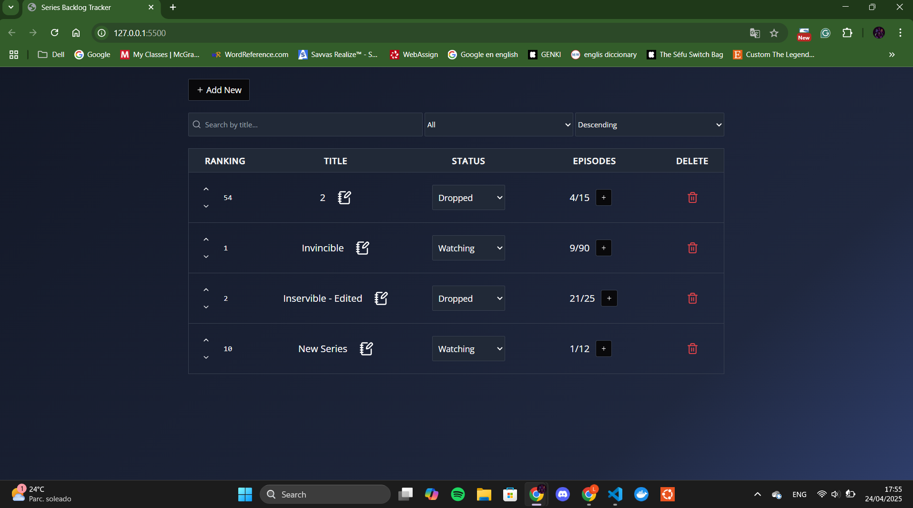

# 🎬 Series Tracker Frontend

Este proyecto permite visualizar y administrar series televisivas que estés siguiendo. Se conecta con un backend en Go con una base de datos SQLite para gestionar la información de las series.

---

## 🖼️ Screenshot



---

## 🚀 Postman Collection

Accedé a la colección de endpoints para probar el backend:

🔗 [Colección en Postman](https://dijan-7315353.postman.co/workspace/Dijan's-Workspace~49a8a357-f352-4e66-8af6-81bb3a0b2349/collection/43743801-62c28d60-e382-434d-b59c-7cb46812a2f1?action=share&creator=43743801)

---

## 🧰 Requisitos

Tenés dos formas de correr el backend:

### Opción 1: Usando Docker

- Tener Docker instalado y funcionando dentro de WSL.

### Opción 2: Local

- Tener Go (>=1.20) y SQLite instalados.

---

## 🐳 Comandos para usar Docker

### 1. Construir la imagen:

```bash
docker-compose build
```

### 2. Levantar el contenedor:

```bash
docker-compose up
```

### 3. Detener los servicios:
```bash 
docker-compose down
```

